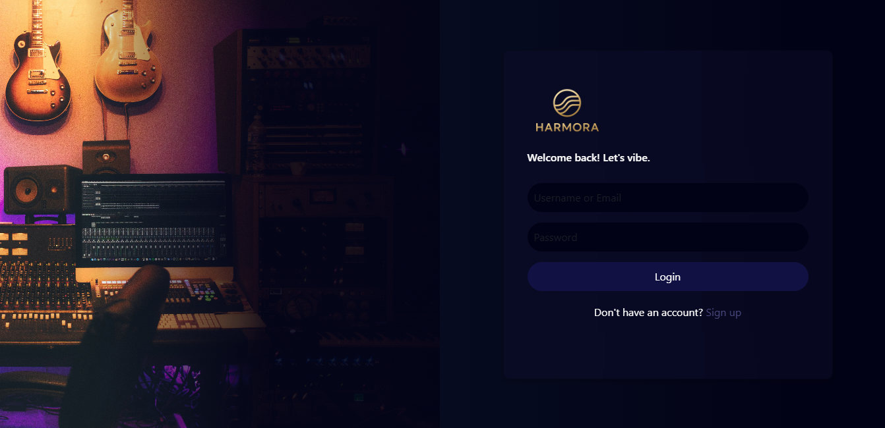
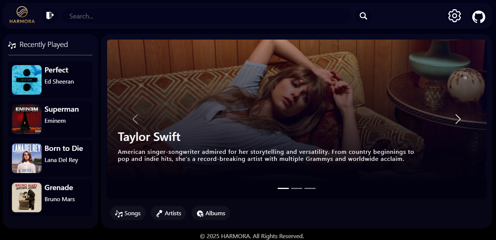
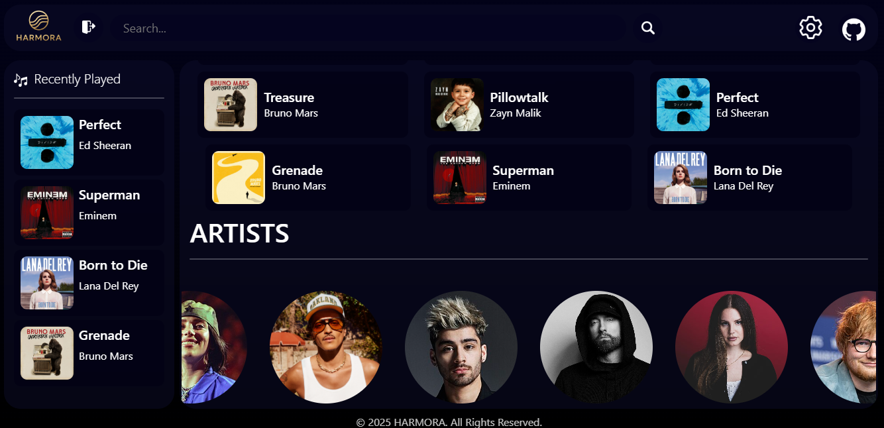
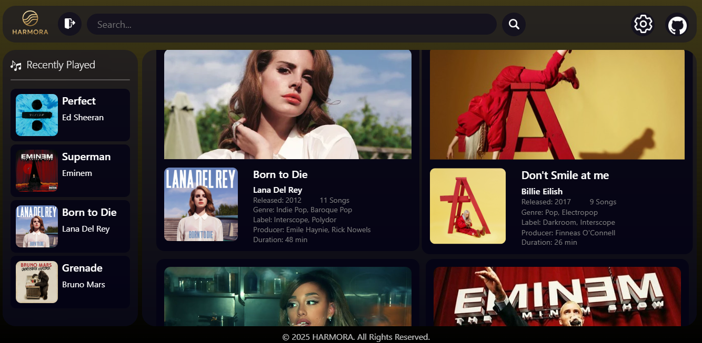
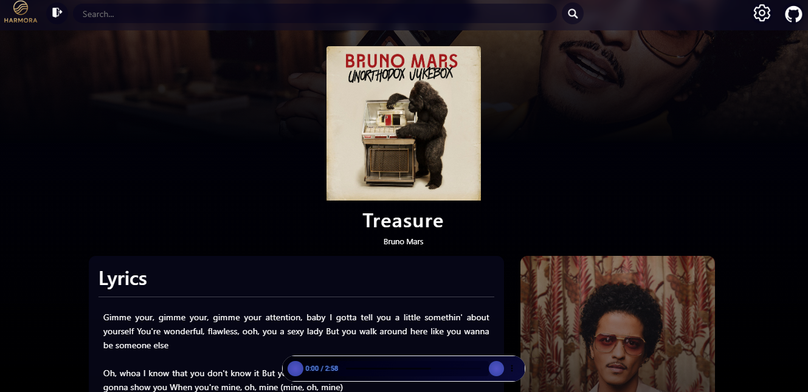

# HARMORA
A modern music streaming platform built to connect people through sound, rhythm, and melody.

HARMORA redefines the way we experience music. Designed with elegance and built for performance, it bridges the gap between artists and listeners — creating a space where every beat resonates, every lyric inspires, and every moment finds its soundtrack.  

## Features

### Login Page
A secure and elegant login interface that ensures a smooth authentication process.  
- User-friendly layout  
- Password protection and form validation  
- Option for future social login integration (Google, Spotify, etc.)

### Dashboard Page
Your personal music hub — showcasing featured artists, playlists, and personalized recommendations.  
- Modern, responsive design  
- Interactive navigation with real-time updates

### Play Page
The heart of HARMORA — where music comes alive.  
- Custom-designed audio player  
- Album art display with animated transitions  
- Volume control, looping, and queue system  
- Smooth waveform visualization (planned)

### Signup Page (Pending)
A simple yet engaging registration page (coming soon).  
- Account creation for new users  
- Option to link social media accounts  
- Email verification (upcoming feature)

---

## Preview

  
  
  
  
  

